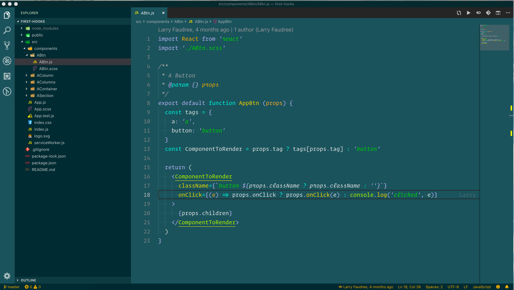

# Perfect C Theme for VS Code
## Perfect Contrast for readability and less eye strain

All colors have contrast to the WCAG Standard. https://www.w3.org/WAI/WCAG21/Understanding/contrast-minimum.html

# Installation
1. Open **Extensions** sidebar panel in VS Code.
2. Search for "Perfect C"
3. Click **Install**
4. Click **Reload** to reload the editor
5. Navigate to Code > Preferences > Color Theme > Perfect C

### HTML

### Javascript

### Vue

### React

### SCSS

### JSON

### Markdown

**Enjoy!**
